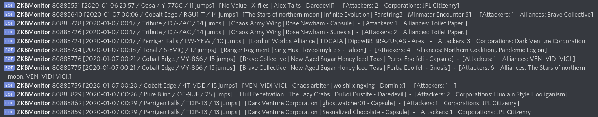

# Eve Online 'Zkillboard RedisQ Monitor' and 'Discord Hook Bot'

## What is it?

Eve Online provides a RESTFul API called 'ESI' that provides access to ingame data.

Zkillboard is a third party site that provides a simple queue service called RedisQ, which streams a list of ship losses in game.    
  
'*redisq_listener.py*' is the monitor side of this package, connecting to RedisQ and downloading a live stream of killmails. They are saved into
an sqlite database, and then broadcast over a ZeroMQ server using the publisher / subscriber model. ID numbers for characters, corporations,
and alliances are looked up using ESI to get the string names.

'*hook_bot.py*' is a Discord bot that connects to a discord channel, connects to the ZeroMQ server as a subscriber, and
broadcasts killmails to discord that meets a set of conditions.

## Project Layout

* ZKBMonitor 
    * cache - Local caches for ZKB and ESI data
    * data - Constants data and the 'Eve Static Data Dump'
        * definitions.py - Globals
        * eve_type_ids.py - Lists of important type ids for game objects
    * tools - Utility modules
        * lookup_esi_names.py - ESI lookups to convert numeric ids to string names
        * lookup_eve_static_dump.py - Perform lookups on the static data dump database
        * redisq_cache.py - Cache data downloaded by redisq_listener
    * redisq_listener.py - Connect to RedisQ, save killmails to SQL, broadcast to ZMQ
    * hook_bot.py - Discord hook bot, connect to ZMQ, receive killmails, broadcast if conditions met
        
### Eve Static Data Dump Download

To run this project a current copy of the 'Eve Static Data Dump' is required. Download from the following location, uncompress, and place in the data directory.

https://www.fuzzwork.co.uk/dump/sqlite-latest.sqlite.bz2

### Discord Secrets
You must also create a new application on Discord for the bot

1. Create a new hook based application http://discordapp.com/developers/applications/me
2. Record the ID and Token for your bot and save them in '*hook_bot.py*'
3. On the developers page, make sure OATH2 is selected and get an invite URL for your bot


## Usage
**Help**
```
[user@host ZKBMonitor]$ python redisq_listener.py --help
Usage: redisq_listener.py [OPTIONS]

Options:
  --loaddata  Load replay test data from zkillboard
  --replay    Replay test data from zkillboard
  --help      Show this message and exit.
```

**Load Test Data**
```
[user@host ZKBMonitor]$ python redisq_listener.py --loaddata
Downloading test data from zkillboard...

Downloading https://zkillboard.com/api/kills/regionID/10000015/page/1/
Downloading https://zkillboard.com/api/kills/regionID/10000015/page/2/
... ... ...
Downloading https://zkillboard.com/api/kills/regionID/10000015/page/24/
Downloading https://zkillboard.com/api/kills/regionID/10000015/page/25/
...finished downloading.
Downloading ESI killmails...
...finished downloading.
Done, data ready for replay.
...exiting.

```

**Replay test data**

```
[user@host ZKBMonitor]$ python redisq_listener.py --replay
Starting in replay mode...

Broadcasting 80321393
Broadcasting 80321399
Broadcasting 80321401
Broadcasting 80321424
```

**Broadcast live data**
```
[user@host ZKBMonitor]$ python redisq_listener.py
Starting in normal mode...

--- Redisq Listener running ---
Broadcasting 80896564
Broadcasting 80896521
Broadcasting 80896473
```


# Discord Output
